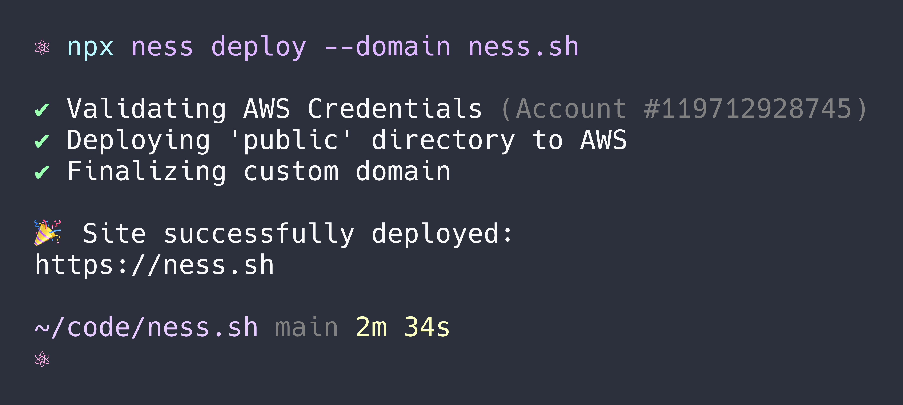

<!-- <figure>
  
  <figcaption>It's a single command.</figcaption>
</figure> -->

Introducing Ness—the easiest way to deploy web sites and apps into your AWS account. I built Ness to simplify the process of shipping web products in a repeatable way with all of the best practices around security and performance baked into a single command.

```
npx ness deploy
```

As a software engineer and maker, I rely on AWS every day to help bring my ideas to life. A year ago, I discovered the [AWS CDK](https://aws.amazon.com/cdk/) and it dramatically improved my ability to stand up infrastructure quickly. I noticed, however, that I was often creating the same handful of resources (or "components" in CDK terms) each time I wanted to deploy a web product: an S3 bucket, a CloudFront distribution, a Route53 hosted zone and aliases, etc. The CDK makes it easy to componentize these resources, but standing up a CDK app for a simple static landing page felt tedious.

### Doesn't Amplify do this?

In short, yes. But, Amplify does _[a lot](https://aws.amazon.com/amplify/features/)_ more. Ness is narrowly focused on deploying web assets to S3 and serving them through CloudFront with sane defaults that follow best practices. This means that the Ness CLI experience is straightforward and extremely simple to use. Amplify, on the other hand, has many additional concerns as it's a much richer product aimed at standing up a variety of supporting resources such as data stores, APIs, and more.

Amplify also has a product surface area that stretches into the AWS console, which can mean that you need to open a browser to complete some web deployment and configuration tasks. This isn't inherently good or bad; it just represents a different philosophy and highlights Amplify's much larger (and more complicated) footprint.

### Netlify and Vercel definitely do this...

Netlify and Vercel also offer CLI commands to deploy to the web with minimal friction, with one important difference: they're paid products and you'll eventually pay a premium over the AWS costs you're accruing if you scale out of their respective free tiers. For many small projects, costs likely won't come into play; but, you also lose a bit of control if you're someone that enjoys managing AWS accounts.

It's worth noting that today Netlify and Vercel have several important features that Ness is lacking—namely preview environments and (lambda) functions. The plan is to add these features (and more) to bring Ness into parity with these commercial products and represent a free, open-source alternative for those that don't mind—or even prefer—to own their own infrastructure.

### Next Steps

Next, I plan to add preview environments for new pull requests on GitHub through an official GitHub Action. I'd love to hear if others are finding this tool useful and what features they'd like to see moving forward. Find me on [Twitter](https://twitter.com/aeduhm) and/or [GitHub](https://github.com/nessjs/ness) (pull requests are welcome!).
